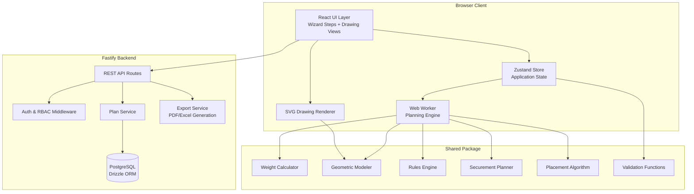

# Design Document: OptiFlow Flatbed Steel Load Planner

## Overview

The OptiFlow Flatbed Steel Load Planner is a browser-based application enabling dispatchers, planners, loaders, and drivers to plan, visualize, verify, and export flatbed steel load configurations. The system models the specialized domain of flatbed steel hauling where placement decisions are driven by deck position, concentrated weight limits, axle distribution, product support requirements, stacking stability, unloading access order, and securement compliance.

The application follows a four-step workflow: **Equipment → Steel Orders → Rules → Generate Load Plan**. The architecture separates pure computational logic (weight calculations, geometric modeling, constraint solving, placement heuristics) from side-effectful layers (persistence, rendering, file I/O) to enable comprehensive testing and deterministic behavior.

### Key Design Decisions

1. **Deterministic heuristic placement** — The Planning Engine uses a priority-ordered heuristic (not optimization/search) so identical inputs always produce identical outputs. This enables caching, diff-based versioning, and reproducible testing.
2. **Pure computation core** — Weight calculations, constraint evaluation, and geometric modeling are implemented as pure functions in the `shared` package, enabling property-based testing without mocking.
3. **Client-side planning engine** — The placement algorithm runs in the browser (Web Worker) for responsiveness. Heavy operations (PDF export, multi-load splitting) may offload to the backend.
4. **SVG-based rendering** — Load drawings use SVG for scalability, print fidelity, and accessibility. Canvas fallback is available for performance-critical pan/zoom interactions.
5. **Event-sourced plan history** — Plan versions are stored as a sequence of mutations, enabling efficient comparison, undo, and audit trails.

## Architecture



### Deployment Architecture

- **Frontend**: Static SPA served via CDN or Vite preview server
- **Backend**: Fastify server with PostgreSQL database
- **Shared**: TypeScript library consumed by both frontend and backend at build time
- **Web Worker**: Planning engine runs in a dedicated worker thread to avoid blocking the UI

## Components and Interfaces

### 1. Equipment Configurator

**Location**: `packages/frontend/src/features/equipment/`  
**State**: Zustand slice `equipmentStore`

```typescript
interface TrailerProfile {
  id: string;
  name: string;
  lengthFt: number; // 48 or 53 standard
  deckWidthIn: number;
  deckHeightIn: number; // from ground
  maxGrossWeight: number; // lbs
  tareWeight: number;
  axleCount: number;
  axlePositions: number[]; // distances from kingpin in inches
  axleWeightRatings: number[]; // per axle group
  kingpinPosition: number; // inches from front of trailer
  rearOverhangLimit: number;
  deckMaterial: 'steel' | 'aluminum' | 'wood';
  stakePockets: Position2D[];
  anchorPoints: Position2D[];
  maxConcentratedLoadPSF: number; // lbs per sq ft
}

interface TractorProfile {
  id: string;
  name: string;
  steerAxleRating: number;
  driveAxleRating: number;
  fifthWheelPosition: number; // from front of tractor
  tareWeight: number;
  driveAxleCount: number; // 1 (single) or 2 (tandem)
}

interface EquipmentCombination {
  tractorId: string;
  trailerId: string;
  availablePayload: number; // calculated
  totalLegalGross: number; // calculated
  perAxleLimits: Record<AxleGroup, number>;
}
```

### 2. Import Service

**Location**: `packages/frontend/src/features/import/`  
**Parsing**: Client-side CSV/XLSX parsing using `papaparse` and `xlsx` libraries

```typescript
interface SteelOrderLineItem {
  orderNumber: string;
  customerName: string;
  deliveryStop: number;
  productType: SteelProductType;
  quantity: number;
  pieceWeight: number; // lbs
  dimensions: FreightDimensions; // length, width, height/diameter in inches
  totalLineWeight: number;
  handlingMethod: 'crane' | 'forklift' | 'magnet' | 'manual';
  stackPermission: 'yes' | 'no' | 'conditional';
  maxStackHeight: number; // inches
  maxStackWeight: number; // lbs
  orientationRequirement: 'longitudinal' | 'transverse' | 'any';
  dunnageRequired: boolean;
  specialNotes: string;
}

type SteelProductType =
  | 'coil_hot_rolled' | 'coil_cold_rolled' | 'coil_galvanized'
  | 'sheet_bundle' | 'plate' | 'rebar_bundle' | 'wire_rod_coil'
  | 'beam_i' | 'beam_h' | 'beam_wide_flange'
  | 'channel' | 'angle' | 'flat_bar' | 'round_bar'
  | 'pipe' | 'tube' | 'hollow_structural_section'
  | 'roofing_sheet_bundle' | 'wire_mesh_panel'
  | 'fabricated_assembly' | 'palletized' | 'mixed_bundle';
```

### 3. Geometric Modeler

**Location**: `packages/shared/src/geometry/`  
**Pure functions** — no side effects, fully testable

```typescript
type GeometricType =
  | 'rectangular'
  | 'long_rectangular_bundle'
  | 'cylindrical_bundle'
  | 'horizontal_coil'
  | 'vertical_coil'
  | 'plate_stack'
  | 'irregular';

interface FreightGeometry {
  type: GeometricType;
  boundingBox: { length: number; width: number; height: number }; // inches
  contactFootprint: { area: number; shape: 'rectangle' | 'line' | 'circle' }; // sq inches
  centerOfMass: Position3D; // relative to item origin
  cradleAngle?: number; // for cylindrical items, degrees
  chockDimensions?: { width: number; height: number }; // for horizontal coils
}

interface PlacedFreight {
  item: SteelOrderLineItem;
  geometry: FreightGeometry;
  position: Position3D; // x, y, z relative to deck origin at kingpin
  orientation: 'longitudinal' | 'transverse';
  supportMethod: 'direct_to_deck' | 'on_dunnage' | 'on_prior_layer';
  layer: number; // 0 = deck level, 1 = first stack, etc.
}

// Pure functions
function assignGeometricType(productType: SteelProductType): GeometricType;
function calculateContactFootprint(geometry: FreightGeometry): number; // sq inches
function calculateDeckPressure(weight: number, footprint: number): number; // PSF
function calculateCradleAngle(diameter: number, cradleWidth: number): number;
```

### 4. Weight Calculator

**Location**: `packages/shared/src/weight/`  
**Pure functions** — deterministic calculations

```typescript
interface WeightMetrics {
  steerAxleWeight: number;
  driveAxleWeight: number;
  trailerAxleWeight: number;
  totalGrossWeight: number;
  longitudinalCG: number; // inches from kingpin
  lateralCGOffset: number; // inches from centerline (positive = right)
  maxConcentratedLoad: number; // PSF at worst point
  perAxlePercentage: Record<AxleGroup, number>; // % of rating used
}

// Pure functions
function calculateWeightMetrics(
  placedFreight: PlacedFreight[],
  equipment: EquipmentCombination,
  trailer: TrailerProfile,
  tractor: TractorProfile
): WeightMetrics;

function calculateAxleLoads(
  itemWeight: number,
  itemCGPosition: number, // from kingpin
  trailerAxlePositions: number[],
  kingpinToFifthWheel: number
): Record<AxleGroup, number>;

function calculateConcentratedLoad(
  item: PlacedFreight,
  overlappingItems: PlacedFreight[]
): number; // PSF
```

### 5. Rules Engine

**Location**: `packages/shared/src/rules/`

```typescript
type RuleType = 'hard_constraint' | 'soft_preference' | 'advisory';

interface Rule {
  id: string;
  name: string;
  description: string;
  type: RuleType;
  evaluate: (context: RuleContext) => RuleResult;
  applicability?: (context: RuleContext) => boolean;
}

interface RuleContext {
  placedFreight: PlacedFreight[];
  equipment: EquipmentCombination;
  trailer: TrailerProfile;
  tractor: TractorProfile;
  weightMetrics: WeightMetrics;
}

interface RuleResult {
  passed: boolean;
  ruleId: string;
  ruleType: RuleType;
  message: string; // plain language
  affectedItems: string[]; // order numbers
  threshold?: number;
  actual?: number;
  suggestedAction?: string;
}

// Pure function
function evaluateAllRules(
  rules: Rule[],
  context: RuleContext
): { results: RuleResult[]; canApprove: boolean };
```

### 6. Planning Engine (Placement Algorithm)

**Location**: `packages/shared/src/planner/`  
**Execution**: Runs in a Web Worker on the client

```typescript
interface PlanRequest {
  items: SteelOrderLineItem[];
  equipment: EquipmentCombination;
  trailer: TrailerProfile;
  tractor: TractorProfile;
  rules: Rule[];
  patternOverride?: LoadPattern;
}

interface PlanResult {
  success: boolean;
  loads: LoadPlan[]; // multiple if freight split
  unplaceableItems: UnplaceableItem[];
  warnings: RuleResult[];
}

interface LoadPlan {
  id: string;
  version: number;
  placedFreight: PlacedFreight[];
  weightMetrics: WeightMetrics;
  securement: SecurementPlan;
  loadingSequence: LoadingStep[];
  unloadingInstructions: UnloadingInstruction[];
  pattern: LoadPattern;
}

type LoadPattern =
  | 'layered' | 'column_building' | 'row_building'
  | 'long_product' | 'nested' | 'customer_zoning' | 'mixed';

// Deterministic heuristic — same input always produces same output
function generateLoadPlan(request: PlanRequest): PlanResult;
```

### 7. Securement Planner

**Location**: `packages/shared/src/securement/`

```typescript
interface SecurementPlan {
  tieDowns: TieDown[];
  blocking: BlockingItem[];
  totalWLL: number; // working load limit
  compliant: boolean; // meets FMCSA requirements
}

interface TieDown {
  id: string;
  type: 'chain' | 'strap' | 'chain_with_binder';
  wll: number; // working load limit in lbs
  assignedItem: string; // freight order number
  anchorPointId: string;
  routeDescription: string;
  edgeProtectorRequired: boolean;
}

// Pure functions
function calculateMinTieDowns(itemLength: number, itemWeight: number): number;
function calculateRequiredWLL(cargoWeight: number): number; // 50% rule
function assignSecurement(
  placedFreight: PlacedFreight[],
  trailer: TrailerProfile
): SecurementPlan;
```

### 8. Drawing Renderer

**Location**: `packages/frontend/src/features/drawing/`

```typescript
interface DrawingView {
  type: 'top' | 'left_side' | 'right_side' | 'front' | 'rear';
  svgContent: string;
  viewBox: { x: number; y: number; width: number; height: number };
}

interface DrawingOptions {
  showSecurement: boolean;
  showDunnage: boolean;
  showWeightAnnotations: boolean;
  showDimensions: boolean;
  highlightedItemId?: string;
  colorBy: 'stop' | 'product_type' | 'weight';
  scale: number;
}
```

### 9. Export Service

**Location**: `packages/backend/src/services/export/`

Generates PDF (via `pdfkit` or `puppeteer`) and Excel (via `exceljs`) exports server-side to avoid bloating the client bundle.

### 10. Plan Service & Versioning

**Location**: `packages/backend/src/services/plan/`

```typescript
interface PlanVersion {
  planId: string;
  version: number;
  status: 'draft' | 'pending_approval' | 'approved' | 'rejected' | 'superseded';
  createdBy: string;
  createdAt: Date;
  approvedBy?: string;
  approvedAt?: Date;
  rejectionReason?: string;
  data: LoadPlan;
}
```

## Data Models

### Database Schema (PostgreSQL via Drizzle ORM)

```mermaid
erDiagram
    users ||--o{ user_roles : has
    users ||--o{ load_plans : creates
    users ||--o{ plan_approvals : approves

    equipment_trailers ||--o{ load_plans : used_in
    equipment_tractors ||--o{ load_plans : used_in

    load_plans ||--o{ plan_versions : has
    load_plans ||--o{ plan_items : contains
    load_plans ||--o{ plan_warnings : has
    load_plans ||--|{ multi_load_sets : belongs_to

    plan_versions ||--o{ verification_checklists : has
    plan_items ||--o{ securement_assignments : has

    rules ||--o{ rule_audit_log : tracked_by

    users {
        uuid id PK
        string email
        string name
        timestamp created_at
    }

    user_roles {
        uuid id PK
        uuid user_id FK
        enum role
    }

    equipment_trailers {
        uuid id PK
        string name
        float length_ft
        float deck_width_in
        float max_gross_weight
        float tare_weight
        json axle_positions
        json axle_ratings
        json stake_pockets
        json anchor_points
        float max_concentrated_load_psf
        boolean is_template
    }

    equipment_tractors {
        uuid id PK
        string name
        float steer_axle_rating
        float drive_axle_rating
        float fifth_wheel_position
        float tare_weight
        int drive_axle_count
    }

    load_plans {
        uuid id PK
        uuid created_by FK
        uuid trailer_id FK
        uuid tractor_id FK
        int current_version
        enum status
        json freight_manifest
        timestamp created_at
        timestamp updated_at
    }

    plan_versions {
        uuid id PK
        uuid plan_id FK
        int version_number
        json placed_freight
        json weight_metrics
        json securement_plan
        json loading_sequence
        json warnings
        enum status
        timestamp created_at
    }

    rules {
        uuid id PK
        string name
        string description
        enum type
        json conditions
        boolean is_active
        uuid created_by FK
    }

    rule_audit_log {
        uuid id PK
        uuid rule_id FK
        uuid changed_by FK
        enum previous_type
        enum new_type
        timestamp changed_at
    }
}
```

### Key State Shape (Zustand)

```typescript
interface LoadPlannerState {
  // Step 1: Equipment
  selectedTractor: TractorProfile | null;
  selectedTrailer: TrailerProfile | null;
  combination: EquipmentCombination | null;

  // Step 2: Orders
  orderItems: SteelOrderLineItem[];
  importErrors: ImportError[];

  // Step 3: Rules
  activeRules: Rule[];
  ruleAcknowledgements: string[]; // acknowledged advisory rule IDs

  // Step 4: Plan
  currentPlan: PlanResult | null;
  planVersion: number;
  selectedItemId: string | null;
  drawingOptions: DrawingOptions;
  warnings: RuleResult[];

  // UI
  currentStep: 1 | 2 | 3 | 4;
  isGenerating: boolean;
  unsavedChanges: boolean;
}
```

## Correctness Properties

*A property is a characteristic or behavior that should hold true across all valid executions of a system — essentially, a formal statement about what the system should do. Properties serve as the bridge between human-readable specifications and machine-verifiable correctness guarantees.*

### Property 1: Equipment payload calculation consistency

*For any* valid tractor-trailer combination, the calculated available payload SHALL equal the total legal gross weight minus tractor tare weight minus trailer tare weight. This value SHALL be consistent regardless of the order in which tractor and trailer are selected, and when this value is negative, the combination SHALL be rejected.

**Validates: Requirements 1.5, 1.6**

### Property 2: Trailer profile axle rating validation

*For any* trailer profile, the profile SHALL be accepted only when the sum of axle weight ratings is greater than or equal to (maximum gross weight minus tare weight). Profiles violating this constraint SHALL be rejected with a validation error.

**Validates: Requirements 1.4**

### Property 3: Import field round-trip preservation

*For any* valid steel order line item, serializing it to CSV format and parsing it back SHALL produce an equivalent object with all fields preserved (order number, product type, dimensions, weights, handling method, stacking permissions, etc.).

**Validates: Requirements 2.2**

### Property 4: Import validation error identification

*For any* steel order line item with one or more required fields missing or containing invalid values, the Import Service SHALL produce a non-empty error set that identifies the specific row number and field name for each invalid entry.

**Validates: Requirements 2.3, 2.5**

### Property 5: Geometric type assignment and footprint calculation

*For any* steel product type and valid dimensions, the geometric type assignment SHALL be deterministic (same type always returns same geometry), the contact footprint area SHALL be a positive finite number, and for horizontal cylindrical items, a valid cradle angle (0° < angle < 90°) SHALL be computed.

**Validates: Requirements 3.1, 3.2, 3.3, 3.4**

### Property 6: Weight metrics conservation invariant

*For any* set of placed freight items on a valid equipment combination, the sum of all axle group weights (steer + drive + trailer) SHALL equal the total gross vehicle weight, which SHALL equal tractor tare + trailer tare + sum of all individual freight weights. This invariant SHALL hold after initial generation and after any manual adjustment (move, swap, remove).

**Validates: Requirements 6.1, 6.2, 6.6, 11.5**

### Property 7: Placement determinism

*For any* valid plan request (items, equipment, rules), invoking the planning engine twice with identical inputs SHALL produce bit-for-bit identical placement results — same positions, orientations, layers, and securement assignments for all items.

**Validates: Requirements 5.2**

### Property 8: Hard constraint satisfaction in generated plans

*For any* generated load plan that reports success, evaluating all active hard constraints against the placed freight SHALL produce zero violations. This includes: no axle overweight, no gross weight exceedance, no concentrated load exceedance, no boundary violations, and proper anti-roll securement for cylindrical items.

**Validates: Requirements 5.3, 4.2**

### Property 9: Stop-order accessibility invariant

*For any* generated load plan with multiple delivery stops, for every item assigned to stop N, no item assigned to a later stop (M > N) SHALL block access to the stop-N item. For overhead crane unloading, nothing from a later stop is stacked above. For side unloading, no later-stop item blocks lateral access at the trailer edge.

**Validates: Requirements 8.2, 8.4, 8.5**

### Property 10: Stacking safety invariant

*For any* placed freight configuration in a generated plan: (a) no item marked "no stack" has another item above it, (b) the cumulative weight above any item does not exceed its maximum stack weight rating, and (c) total stack height at any position does not exceed the lesser of the item's maximum stack height and the trailer's legal height limit.

**Validates: Requirements 7.1, 7.2, 7.3**

### Property 11: Steel-specific support and protection requirements

*For any* generated load plan: horizontal coils SHALL have anti-roll securement (racks/cradles/chocking), dissimilar-hardness stacked items SHALL have dunnage between layers, long products SHALL have ≥ 2 support points with span ≤ maximum, and plate/sheet stacks SHALL have edge protection and banding.

**Validates: Requirements 7.4, 7.5, 7.6, 7.7**

### Property 12: Securement FMCSA compliance

*For any* placed freight item with length L and weight W, the assigned securement SHALL have at least `max(2, ceil(L / 120))` tie-downs, the aggregate working load limit of all tie-downs SHALL be ≥ 50% of W, each tie-down SHALL reference a valid anchor point on the trailer, and coil items SHALL have coil-specific securement (chain through eye, blocking, chocking).

**Validates: Requirements 9.1, 9.3, 9.4, 9.5**

### Property 13: Multi-load split item conservation

*For any* plan request where freight must be split across multiple trailers, the union of freight items across all resulting load plans SHALL exactly equal the original input item set (no items lost, no items duplicated), and all items for a single delivery stop SHALL be placed on the same trailer unless physically impossible.

**Validates: Requirements 16.1, 16.2, 16.3**

### Property 14: Warning severity classification mapping

*For any* rule evaluation result, hard constraint violations SHALL produce "Error" severity, soft preference violations SHALL produce "Warning" severity, and advisory rule notes SHALL produce "Info" severity. Plan approval SHALL be enabled if and only if zero "Error" severity warnings exist.

**Validates: Requirements 12.2, 4.1, 12.5**

### Property 15: Loading sequence reproduces plan

*For any* generated load plan, executing the loading sequence steps in order (placing each item at its specified position with specified orientation, dunnage, and support method) SHALL reproduce the exact placed freight configuration of the original plan.

**Validates: Requirements 13.1, 13.2**

### Property 16: Role-based access control enforcement

*For any* user with a set of assigned roles, their effective permissions SHALL equal the union of all permissions defined for their roles. For any action requiring Administrator_Role (modify equipment, rules, or user assignments), non-administrator users SHALL be denied regardless of other roles held.

**Validates: Requirements 17.2, 17.4, 17.5**

### Property 17: Customer view data isolation

*For any* customer viewing a shared plan link, the displayed items SHALL contain only freight assigned to that customer's delivery stops — no items from other customers SHALL be visible.

**Validates: Requirements 15.5**

## Error Handling

### Import Errors
- **Invalid file format**: Display message identifying the file type issue; suggest correct formats (CSV, XLSX)
- **Missing required fields**: Highlight row/field with inline correction UI; prevent proceeding until resolved
- **Duplicate order-line combinations**: Present duplicates in a resolution dialog; allow keep/merge/remove
- **Type coercion failures**: Show expected vs. actual type for each failed field

### Planning Engine Errors
- **Unplaceable items**: Return structured error with item IDs, the blocking constraint, and suggested corrective actions (e.g., "Reduce quantity", "Select larger trailer", "Allow different orientation")
- **Timeout (>30s)**: Cancel worker execution, report partial results if available, suggest reducing item count or relaxing soft preferences
- **Multi-load failure**: If stop integrity cannot be maintained, report which stop's items are too large for a single trailer

### Weight/Balance Errors
- **Overweight axle**: Highlight the axle group, show excess weight, suggest redistribution direction
- **Negative payload**: Block equipment combination selection with clear message about weight incompatibility

### Runtime Errors
- **Network interruption**: Queue operations locally (IndexedDB via `idb-keyval`); synchronize on reconnection; display offline indicator
- **WebSocket disconnect**: Reconnect with exponential backoff; preserve local state
- **Worker crash**: Restart worker, retry operation once, then report failure

### Access Control Errors
- **Insufficient permissions**: Display role requirement; do not expose unauthorized functionality in UI
- **Session expiry**: Redirect to login with return URL; preserve unsaved work locally

## Testing Strategy

### Unit Tests (Vitest)

Focus on specific examples and edge cases:
- Equipment validation boundary values (zero payload, exact match at threshold)
- Import parsing for each of the ~20 steel product types
- Geometric type assignment for all product categories (exhaustive mapping test)
- Edge cases in cradle angle calculation (very small/large diameters, near-zero cradle width)
- Warning message formatting (plain language, no formulas)
- Role permission matrix checks (each role × each action)
- Plan version state transitions (draft → pending → approved/rejected)
- Loading/unloading instruction field completeness
- Drawing view generation (all 5 view types produced)

### Property-Based Tests (fast-check + Vitest)

Property-based testing is highly applicable to this feature because the core logic consists of pure functions with clear input/output behavior, universal invariants (weight conservation, constraint satisfaction), and large input spaces (arbitrary freight configurations, unlimited tractor/trailer combinations, varying steel product mixes).

**Configuration:**
- Library: `fast-check` (already in project devDependencies)
- Minimum iterations: 100 per property
- Each test tagged with: `Feature: flatbed-load-planner, Property {N}: {description}`
- Shrinking enabled for all generators to find minimal failing cases

**Custom Generators Required:**
- `arbitraryTrailerProfile()` — valid trailer with randomized dimensions, axle counts/positions/ratings, weight limits
- `arbitraryTractorProfile()` — valid tractor with randomized axle ratings and tare weight
- `arbitrarySteelOrderLineItem()` — random product types, dimensions, weights, stacking permissions
- `arbitraryPlacedFreight(trailer)` — freight placed within valid deck bounds
- `arbitraryFreightSet(n)` — a set of n random order items for plan generation
- `arbitraryLoadPlan()` — a complete valid plan (for testing adjustments and exports)

**Properties to implement (17 total):**
- Property 1: Equipment payload calculation consistency
- Property 2: Trailer profile axle rating validation
- Property 3: Import field round-trip preservation
- Property 4: Import validation error identification
- Property 5: Geometric type and footprint calculation
- Property 6: Weight metrics conservation invariant
- Property 7: Placement determinism
- Property 8: Hard constraint satisfaction in generated plans
- Property 9: Stop-order accessibility invariant
- Property 10: Stacking safety invariant
- Property 11: Steel-specific support and protection requirements
- Property 12: Securement FMCSA compliance
- Property 13: Multi-load split item conservation
- Property 14: Warning severity classification mapping
- Property 15: Loading sequence reproduces plan
- Property 16: Role-based access control enforcement
- Property 17: Customer view data isolation

### Integration Tests

- File import end-to-end (CSV → parsed items → validated manifest)
- Excel import with real-world steel order spreadsheet format
- Plan generation → weight calculation → rule evaluation full pipeline
- Plan versioning CRUD operations (create, save, retrieve, compare)
- Export generation (PDF section presence, Excel sheet structure)
- Multi-load splitting with realistic overweight/oversized scenarios
- Rule audit logging on classification changes
- Offline edit → reconnection → synchronization cycle

### End-to-End Tests

- Complete four-step workflow: Equipment → Orders → Rules → Generate
- Manual adjustment drag-and-drop → recalculation → warning display
- Approval workflow: submit → review → approve/reject → lock
- Driver verification checklist completion
- Shared link access with different roles
- Multi-load plan with manual reassignment between trailers

### Performance Tests

- Plan generation with 50 items under 30 seconds
- Drawing render under 3 seconds after generation
- Manual adjustment recalculation under 2 seconds
- Drawing update under 1 second after adjustment
- 20 concurrent planners simulation without response degradation
